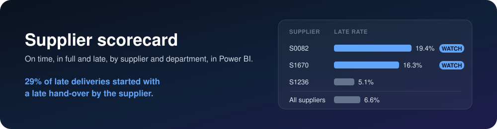
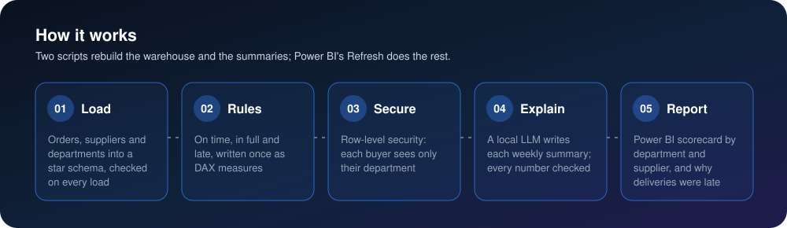
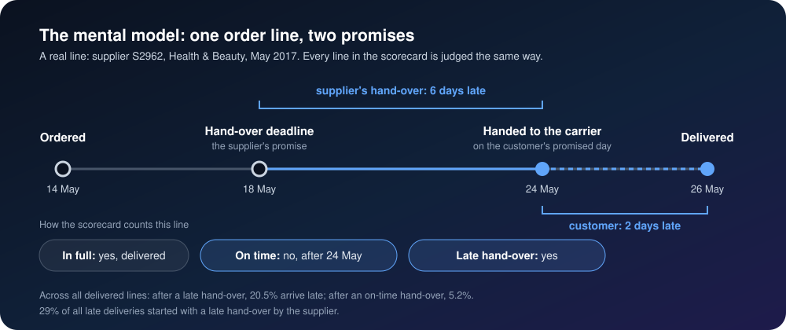
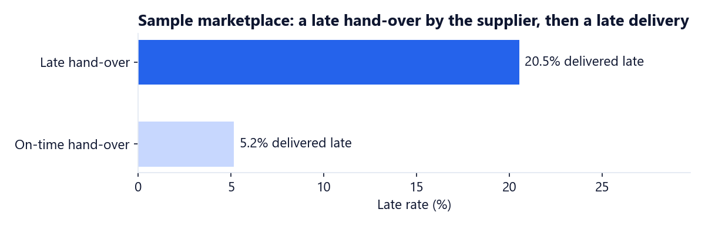
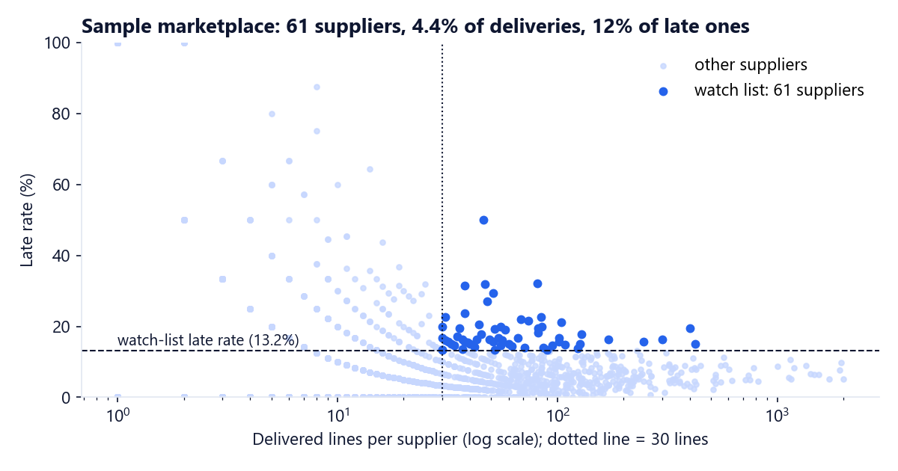
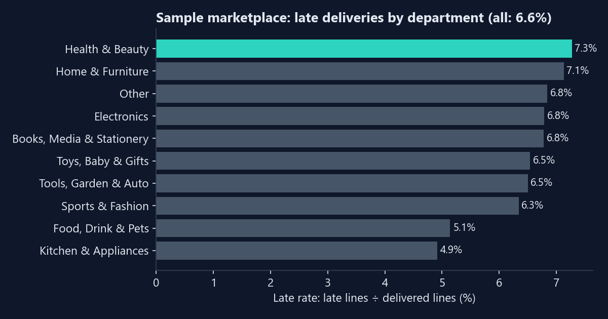
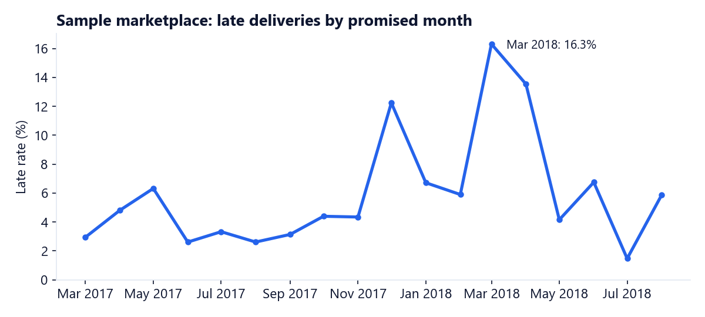

<p align="center">
  
</p>

<p align="center">
  
  
  
  
  
</p>

## The problem

Buyers find out which suppliers deliver late or short when the shelf is already empty. The order
history holds the answer, but it sits in separate exports, nobody agrees on what "on time" means, and
when a delivery is late nobody can say whether the supplier or the carrier caused it.

## What this builds

A Power BI supplier scorecard on a PostgreSQL star schema. It scores every supplier and department on
on-time-in-full, fill rate and late rate, flags the suppliers that need a call, separates late
deliveries that started with the supplier from the rest, and puts a short written summary of the week
beside the charts. Each buyer sees only their own department.

<p align="center">
  
</p>

### The mental model: one order line, two promises

Every order line carries two promises. The **supplier** promises to hand the item to the carrier by a
deadline. The **customer** is promised a delivery date. The scorecard judges each line against both, so
a late delivery can be traced back to where it started.

<p align="center">
  
</p>

| Term | Rule |
|---|---|
| In full | The line was delivered |
| On time | Delivered on or before the date promised to the customer |
| Late | Delivered after that date |
| Late hand-over | The carrier got it after the supplier's hand-over deadline |
| OTIF | On-time lines ÷ all order lines |
| Fill rate | Delivered lines ÷ all order lines |
| Late rate | Late lines ÷ delivered lines |
| Watch list | A supplier with 30+ delivered lines and a late rate at least twice the rate of all suppliers (both numbers are client settings) |

The rules are written once, as two DAX calculated columns, and every measure filters on them
([`powerbi/03-measures.dax`](powerbi/03-measures.dax)).

## What it found

**98,666 orders (112,650 order lines from 3,095 suppliers): 29% of late deliveries started with a late
hand-over by the supplier, and 61 suppliers with 4.4% of deliveries caused 12% of late deliveries.**

| Question | Answer |
|---|---|
| How are deliveries doing? | 91.4% on time and in full; 97.8% of lines delivered; 6.6% of delivered lines late, by 10.5 days on average |
| Does it start with the supplier? | After a late hand-over, 20.5% of deliveries arrive late; after an on-time one, 5.2%. A late hand-over makes a late delivery 4 times as likely |
| Which suppliers? | 61 suppliers (2.1% of the 2,970 that delivered) are on the watch list: 4.4% of deliveries, 12.0% of late ones. The supplier with the most late lines, S0082, was late on 78 of its 402 (19.4%) |
| Which departments? | Health & Beauty is late most often (7.3%), Kitchen & Appliances least (4.9%) |
| When? | Late rates jumped in December 2017 (12.2%) and in March and April 2018 (16.3% and 13.5%); every other month stayed between 1.5% and 6.8% |









Every number above is computed in [`analysis/analysis.ipynb`](analysis/analysis.ipynb) straight from
the source files, and matched by [`sql/check_numbers.sql`](sql/check_numbers.sql) on the warehouse.

## The weekly summary

`summarize.py` asks a local model (llama3.2, 3B, through Ollama) to write two or three sentences per
department from the week's numbers. The model only puts the numbers into words. Before a summary is
saved, three checks run: every number in it must be one of the facts, every supplier it names must be
the one in the facts, and it must say the late rate went the way it really went. A summary that fails
is written again; after three tries the run stops and saves nothing. For the week of 27 August 2018,
one run wrote (the wording changes from run to run; the numbers do not):

> Home & Furniture: 375 order lines were due this week. The late rate was 3.0%, down from 6.8% last
> week, and 96.0% arrived on time and in full. Follow up with S0193, which had 4 late lines.

The checks earn their place: on the first runs the model wrote that the late rate "increased" when it
fell, and named a supplier it copied from the prompt's example. Both are now rejected and rewritten.

## The Power BI report

Four pages: **Scorecard** (the cards, the late rate by month and department, and this week's
summaries), **Suppliers** (the watch list and every supplier's score), **Why late** (the supplier's
hand-over against the customer's delivery) and **Supplier detail** (drill-through to one supplier's
lines). A `Buyer` role filters every page to the buyer's department.

The [`powerbi/`](powerbi/) folder rebuilds the report from nothing by copy and paste: every Power Query
step, the model, every measure, every visual with its fields, the theme, every interaction and filter,
the numbers each page must show, and a 38-step build checklist.

## How it is built

- **Client settings** ([`config/client.yaml`](config/client.yaml), read only through `load_config()` in
  [`config.py`](config.py)): the client's name, input file names, rule thresholds, summary week and model,
  chart window and colours. The password is in `.env`. [`theme.py`](theme.py) writes the Power BI theme
  from the colours.
- **Load** ([`load.py`](load.py), [`sql/`](sql/)): `load.py` first checks every input file in
  `data/input/` and its columns, then loads the needed columns into a `raw` schema, where primary keys
  stop duplicates and a foreign key stops a product category missing from the categories file.
  [`02_star.sql`](sql/02_star.sql) builds the star schema: `fact_order_line` (one row per order line,
  with both promises' dates), `dim_supplier`, `dim_product` (category and department), `dim_date`, and
  `client_setting` (the rule thresholds). [`03_checks.sql`](sql/03_checks.sql) checks that every line
  reached the fact table, every department has a buyer, every promised date is in the calendar and no
  delivery comes before its purchase. The load runs in one transaction: if a check fails, nothing
  changes and the report keeps the last good load.
- **Rules:** `Delivery` and `Handover` calculated columns, then 19 measures built on them, from
  `Order Lines` to `Watch List Share of Late %`; the thresholds come from `client_setting`.
- **Secure:** row-level security with one dynamic role. `buyer` maps each buyer's sign-in to a
  department, and `USERPRINCIPALNAME()` picks it, so adding a buyer means adding one row to
  [`data/input/buyers.csv`](data/input/buyers.csv), not a new role.
- **Explain:** [`summarize.py`](summarize.py) with Pydantic for the model's JSON output and the three
  checks above.
- **Report:** the scorecard reads the `star` schema directly; Refresh in Power BI after a load.

## Run it

You need Docker Desktop, Python 3.10+, [Ollama](https://ollama.com) and Power BI Desktop (free, Windows).
Copy `.env.example` to `.env`, and download the four order files into `data/input/` (commands in
[`data/input/README.md`](data/input/README.md)). Then:

```bash
docker compose up -d
pip install -r requirements.txt
python load.py
ollama pull llama3.2:3b
python summarize.py
python theme.py
python -m nbconvert --to notebook --execute --inplace analysis/analysis.ipynb
```

Then build the report with [`powerbi/08-build-checklist.md`](powerbi/08-build-checklist.md). PostgreSQL
listens on `127.0.0.1:5435`, on this computer only.

If Ollama crashes while loading the model on an older NVIDIA card, run it on the CPU: set
`CUDA_VISIBLE_DEVICES=-1` and `GGML_VK_VISIBLE_DEVICES=-1`, then start `ollama serve`. The 3B model
writes the eleven summaries in about three minutes on a laptop CPU.

```
├── config/client.yaml   every client value (name, input files, rules, summary, chart window, colours)
├── config.py            load_config(): the only reader of client values
├── .env.example         the database password (copy to .env, never committed)
├── data/input/          the client's six files, with a README of their columns
├── sql/                 raw tables, star schema, load checks, number checks
├── load.py              input check → PostgreSQL → star schema → checks
├── summarize.py         the weekly summaries, written by a local LLM and checked
├── theme.py             the Power BI theme from the client's colours
├── analysis/            the notebook that computes every number
├── powerbi/             the step-by-step report build
└── docs/                the diagrams and charts in this README
```

## Limits

- The suppliers are marketplace sellers that ship straight to customers; the hand-over deadline is the
  marketplace's shipping limit for each item.
- The carrier's pick-up date is recorded per order, so in the 1.3% of orders with several suppliers each
  supplier gets the same date.
- "In full" means delivered: the data has no partial quantities, so a line is delivered or not.
- A late delivery after a late hand-over is linked to the supplier, not proven to be caused by it: the
  carrier may also have been slow.
- The history ends in August 2018 (later months hold only the orders that were already closed), so
  the trend charts run from March 2017 to August 2018, the months with at least 1,000 deliveries.
- The watch-list rule (30 lines, twice the late rate) is a starting point to tune with the buyers.

## Data

Order history of Olist, a Brazilian marketplace, from 2016 to 2018, anonymised and published by Olist
in [olist/work-at-olist-data](https://github.com/olist/work-at-olist-data) (MIT licence) and on Kaggle as
the [Brazilian E-Commerce Public Dataset](https://www.kaggle.com/datasets/olistbr/brazilian-ecommerce)
(CC BY-NC-SA 4.0). Four of its files are the inputs; they are not committed, so download them into
`data/input/` (commands in [`data/input/README.md`](data/input/README.md)). Sellers are treated as
suppliers. `data/input/categories.csv` takes its category codes and English names from the same
dataset (CC BY-NC-SA 4.0) and adds this project's departments; `data/input/buyers.csv` (made-up buyer
addresses at example.com) is this project's own. This is not work for Olist.

---

Built by [Omar Shalaby](https://github.com/omarshalabyy1) · Power BI, DAX, PostgreSQL, Python, Ollama
